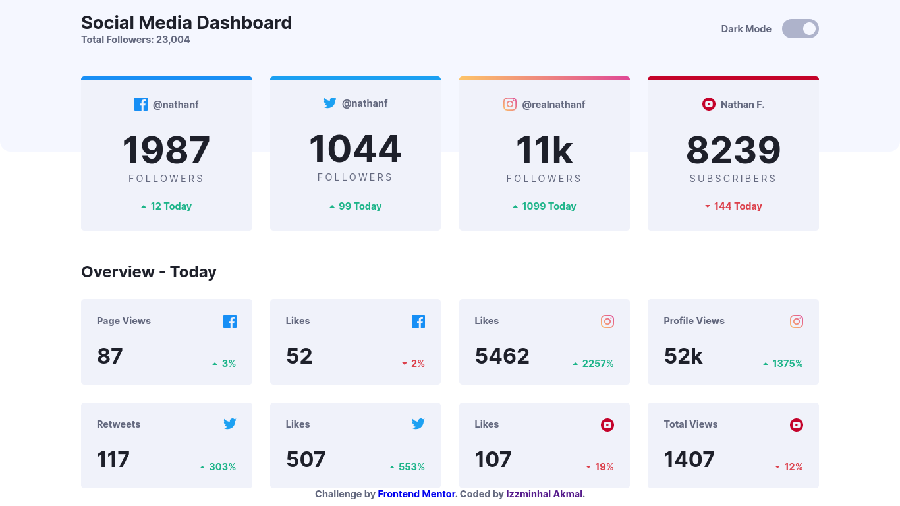
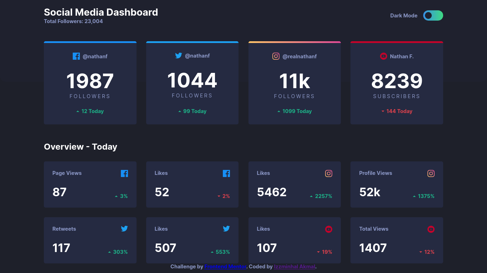

# Frontend Mentor - Social media dashboard with theme switcher solution

This is a solution to the [Social media dashboard with theme switcher challenge on Frontend Mentor](https://www.frontendmentor.io/challenges/social-media-dashboard-with-theme-switcher-6oY8ozp_H). Frontend Mentor challenges help you improve your coding skills by building realistic projects. 

## Table of contents

- [Overview](#overview)
  - [The challenge](#the-challenge)
  - [Screenshot](#screenshot)
  - [Links](#links)
- [My process](#my-process)
  - [Built with](#built-with)
  - [Continued development](#continued-development)
  - [Useful resources](#useful-resources)
- [Author](#author)

## Overview

### The challenge

Users should be able to:

- View the optimal layout for the site depending on their device's screen size
- See hover states for all interactive elements on the page
- Toggle color theme to their preference

### Screenshot

### Links

- Solution URL: [Github](https://github.com/Kemystra/frontendmentor-socmed-dashboard)
- Live Site URL: [Add live site URL here](https://your-live-site-url.com)

## My process

### Built with

- Semantic HTML5 markup
- CSS variables
- CSS Grid

### Continued development

In the next project, I wanted to focus more on code organization when using CSS such as using utility-first CSS.

### Useful resources

- [W3School - Toggle Switch](https://www.w3schools.com/howto/howto_css_switch.asp) - I didn't use this solution in the end, but it definitely gave me some idea on how to implement it.

## Author

- Frontend Mentor - [@Kemystra](https://www.frontendmentor.io/profile/Kemystra)
